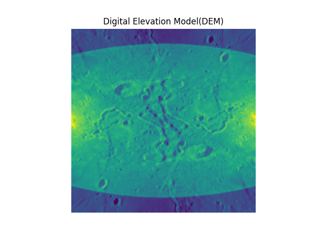

## Lunar Digital Elevation Model (DEM) Reconstruction

Tech Stack: PyTorch, NumPy, SciPy, Matplotlib

----

## Overview

This project implements a Shape-from-Shading pipeline to reconstruct a Lunar Digital Elevation Model (DEM) from a single grayscale Moon image under Lambertian reflectance assumptions.

The goal is to recover surface height from image intensity gradients and evaluate the mathematical consistency of the reconstructed surface.

----

## Methodology

1. Image Preprocessing

Applied Gaussian smoothing to reduce noise.
Computed image gradients using Sobel filters.

2️. Surface Slope Estimation

Under Lambertian assumptions, image gradients approximate surface slopes:
p=∂z/∂x
q=∂z/∂y
Additional smoothing is applied to stabilize the slope field.

3️. Integrability Analysis

For a physically valid surface:
∂x∂q=∂y∂p
The curl of the slope field is computed:
curl=∂𝑞∂𝑥−∂𝑝∂𝑦
curl=∂x∂q​−∂y∂p​
Mean absolute curl is used as an integrability error metric.

4️. Height Reconstruction via Poisson Integration

The surface height z
z is recovered by solving:
∇2z=∇⋅(p,q)
Using an FFT-based Poisson solver in the frequency domain.
This performs global least-squares integration of the slope field.

5️. Baseline Comparison

Naive cumulative integration is implemented as a baseline:
height_direct = np.cumsum(p, axis=1) + np.cumsum(q, axis=0)
This method accumulates rotational inconsistencies and introduces streak artifacts.

----

## Results

Metric	Direct Integration	Poisson Integration
Integrability Error	High	Reduced by ~81%
Gradient Energy	High	Reduced by ~55%

----

## Key Observations:

Poisson reconstruction significantly reduces rotational inconsistencies.
High-frequency gradient energy is suppressed.
The reconstructed surface exhibits improved global coherence and numerical stability.
Direct integration introduces visible streak artifacts due to non-integrable slope accumulation.

----

## Output

The reconstructed Digital Elevation Model (DEM) is visualized using a colormap and normalized for interpretability.

Below is the reconstructed Lunar Digital Elevation Model generated using Poisson integration.

----

## Key Concepts

Shape-from-Shading
Integrability of gradient fields
Curl diagnostics
Poisson equation
FFT-based PDE solvers
Frequency-domain reconstruction
High-frequency noise suppression

----

## Future Improvements

Explicit Helmholtz decomposition of slope field
Robust illumination modeling
Multi-image photometric stereo
Comparison against ground-truth DEM datasets

----

## License

This project is for educational purposes.

----

## Author

Sahithi Bashetty
bashettysahithi@gmail.com